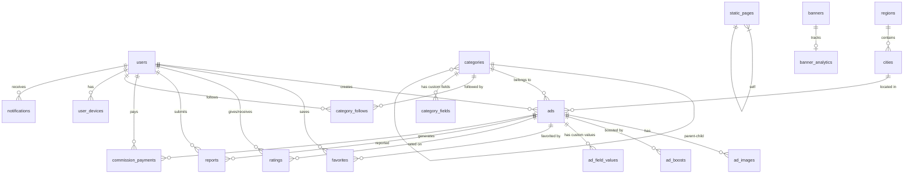

# Barq Wadih (برق واضح) — Database Schema

> **Engine**: MySQL 8 | **Charset**: utf8mb4 | **Collation**: utf8mb4_unicode_ci
>
> All timestamps use `created_at` / `updated_at` (Laravel default). Soft deletes (`deleted_at`) applied where noted.

---

## Entity Relationship Diagram



---

## 1. Users & Authentication

### `users`
Core user table — every user is both buyer and seller.

| Column | Type | Constraints | Description |
|---|---|---|---|
| `id` | BIGINT UNSIGNED | PK, AUTO_INCREMENT | — |
| `name` | VARCHAR(100) | NOT NULL | Display name |
| `email` | VARCHAR(255) | UNIQUE, NULLABLE | Email address |
| `phone` | VARCHAR(20) | UNIQUE, NULLABLE | Phone number (with country code) |
| `phone_verified_at` | TIMESTAMP | NULLABLE | When phone was verified via Firebase OTP |
| `email_verified_at` | TIMESTAMP | NULLABLE | When email was verified |
| `password` | VARCHAR(255) | NULLABLE | Hashed password (nullable if phone-only auth) |
| `avatar` | VARCHAR(500) | NULLABLE | Profile image URL (DO Spaces) |
| `bio` | TEXT | NULLABLE | User bio/description |
| `region_id` | BIGINT UNSIGNED | FK → regions.id, NULLABLE | User's default region |
| `city_id` | BIGINT UNSIGNED | FK → cities.id, NULLABLE | User's default city |
| `is_dealer` | BOOLEAN | DEFAULT FALSE | Whether user is a car dealership |
| `is_verified` | BOOLEAN | DEFAULT FALSE | Verified badge (auto-granted for commission payers) |
| `is_active` | BOOLEAN | DEFAULT TRUE | Admin can deactivate |
| `role` | ENUM('user','admin','super_admin') | DEFAULT 'user' | User role |
| `firebase_uid` | VARCHAR(128) | UNIQUE, NULLABLE | Firebase Auth UID |
| `locale` | ENUM('ar','en') | DEFAULT 'ar' | Preferred language |
| `total_ads_count` | INT UNSIGNED | DEFAULT 0 | Denormalized counter |
| `avg_rating` | DECIMAL(3,2) | DEFAULT 0.00 | Denormalized average rating |
| `rating_count` | INT UNSIGNED | DEFAULT 0 | Denormalized rating count |
| `commissions_paid_count` | INT UNSIGNED | DEFAULT 0 | Track paid commissions for verified badge |
| `commissions_due_count` | INT UNSIGNED | DEFAULT 0 | Track due commissions |
| `last_active_at` | TIMESTAMP | NULLABLE | Last activity timestamp |
| `created_at` | TIMESTAMP | — | — |
| `updated_at` | TIMESTAMP | — | — |
| `deleted_at` | TIMESTAMP | NULLABLE | Soft delete |

**Indexes**: `phone`, `email`, `firebase_uid`, `city_id`, `region_id`, `is_active`, `is_verified`, `role`

---

### `user_devices`
FCM device tokens for push notifications.

| Column | Type | Constraints | Description |
|---|---|---|---|
| `id` | BIGINT UNSIGNED | PK, AUTO_INCREMENT | — |
| `user_id` | BIGINT UNSIGNED | FK → users.id, ON DELETE CASCADE | — |
| `fcm_token` | VARCHAR(500) | NOT NULL | Firebase Cloud Messaging token |
| `device_type` | ENUM('ios','android','web') | NOT NULL | Platform |
| `device_name` | VARCHAR(100) | NULLABLE | Device model name |
| `is_active` | BOOLEAN | DEFAULT TRUE | Whether token is still valid |
| `created_at` | TIMESTAMP | — | — |
| `updated_at` | TIMESTAMP | — | — |

**Indexes**: `user_id`, `fcm_token`, `is_active`

---

### `personal_access_tokens`
Laravel Sanctum tokens (auto-managed by Sanctum).

| Column | Type | Constraints | Description |
|---|---|---|---|
| `id` | BIGINT UNSIGNED | PK, AUTO_INCREMENT | — |
| `tokenable_type` | VARCHAR(255) | NOT NULL | Polymorphic (usually App\Models\User) |
| `tokenable_id` | BIGINT UNSIGNED | NOT NULL | User ID |
| `name` | VARCHAR(255) | NOT NULL | Token name (e.g., 'mobile', 'web') |
| `token` | VARCHAR(64) | UNIQUE | Hashed token |
| `abilities` | TEXT | NULLABLE | JSON array of abilities |
| `last_used_at` | TIMESTAMP | NULLABLE | — |
| `expires_at` | TIMESTAMP | NULLABLE | — |
| `created_at` | TIMESTAMP | — | — |
| `updated_at` | TIMESTAMP | — | — |

---

## 2. Categories

### `categories`
Hierarchical categories with self-referencing parent.

| Column | Type | Constraints | Description |
|---|---|---|---|
| `id` | BIGINT UNSIGNED | PK, AUTO_INCREMENT | — |
| `parent_id` | BIGINT UNSIGNED | FK → categories.id, NULLABLE | NULL = top-level category |
| `name_ar` | VARCHAR(100) | NOT NULL | Arabic name |
| `name_en` | VARCHAR(100) | NOT NULL | English name |
| `slug` | VARCHAR(120) | UNIQUE, NOT NULL | URL-friendly slug |
| `icon` | VARCHAR(500) | NULLABLE | Icon URL or icon class name |
| `image` | VARCHAR(500) | NULLABLE | Category image URL |
| `description_ar` | TEXT | NULLABLE | Arabic description |
| `description_en` | TEXT | NULLABLE | English description |
| `sort_order` | INT | DEFAULT 0 | Display order |
| `is_active` | BOOLEAN | DEFAULT TRUE | Admin toggle |
| `is_free` | BOOLEAN | DEFAULT FALSE | TRUE for Jobs category (no commission) |
| `commission_rate` | DECIMAL(5,4) | NULLABLE | Override global rate (NULL = use global) |
| `meta_keywords` | VARCHAR(500) | NULLABLE | SEO keywords |
| `ads_count` | INT UNSIGNED | DEFAULT 0 | Denormalized counter |
| `prohibited_keywords` | JSON | NULLABLE | Keywords to auto-flag (e.g., "قط", "كلب" for Animals) |
| `created_at` | TIMESTAMP | — | — |
| `updated_at` | TIMESTAMP | — | — |

**Indexes**: `parent_id`, `slug`, `is_active`, `sort_order`

---

### `category_fields`
Dynamic custom fields per category (e.g., Car Type, Model, Mileage for Cars).

| Column | Type | Constraints | Description |
|---|---|---|---|
| `id` | BIGINT UNSIGNED | PK, AUTO_INCREMENT | — |
| `category_id` | BIGINT UNSIGNED | FK → categories.id, ON DELETE CASCADE | — |
| `field_key` | VARCHAR(50) | NOT NULL | Machine key (e.g., `car_type`, `model`, `mileage`) |
| `label_ar` | VARCHAR(100) | NOT NULL | Arabic label |
| `label_en` | VARCHAR(100) | NOT NULL | English label |
| `field_type` | ENUM('text','number','select','multi_select','year','boolean') | NOT NULL | Input type |
| `options` | JSON | NULLABLE | For select/multi_select — `[{"value":"toyota","label_ar":"تويوتا","label_en":"Toyota"}, ...]` |
| `is_required` | BOOLEAN | DEFAULT FALSE | Whether field is mandatory for ad posting |
| `is_filterable` | BOOLEAN | DEFAULT TRUE | Whether field appears in search filters |
| `sort_order` | INT | DEFAULT 0 | Display order in form |
| `placeholder_ar` | VARCHAR(200) | NULLABLE | Arabic placeholder text |
| `placeholder_en` | VARCHAR(200) | NULLABLE | English placeholder text |
| `validation_rules` | JSON | NULLABLE | Laravel validation rules (e.g., `{"min":1900,"max":2026}`) |
| `created_at` | TIMESTAMP | — | — |
| `updated_at` | TIMESTAMP | — | — |

**Indexes**: `category_id`, `field_key`

**Example Seed Data for Cars Category**:
```
category_id: 1 (Cars)
Fields:
  - car_type (select) → Toyota, Nissan, Hyundai, ...
  - car_model (text) → e.g., "Camry"
  - year (year) → 1990-2026
  - mileage (number) → kilometers
  - fuel_type (select) → Petrol, Diesel, Hybrid, Electric
  - transmission (select) → Automatic, Manual
  - color (select) → White, Black, Silver, ...
```

---

## 3. Regions & Cities

### `regions`
Saudi regions/provinces.

| Column | Type | Constraints | Description |
|---|---|---|---|
| `id` | BIGINT UNSIGNED | PK, AUTO_INCREMENT | — |
| `name_ar` | VARCHAR(100) | NOT NULL | Arabic name (e.g., المنطقة الشرقية) |
| `name_en` | VARCHAR(100) | NOT NULL | English name (e.g., Eastern Province) |
| `slug` | VARCHAR(120) | UNIQUE, NOT NULL | — |
| `sort_order` | INT | DEFAULT 0 | — |
| `is_active` | BOOLEAN | DEFAULT TRUE | — |
| `created_at` | TIMESTAMP | — | — |
| `updated_at` | TIMESTAMP | — | — |

**Indexes**: `slug`, `is_active`

---

### `cities`
Cities within regions.

| Column | Type | Constraints | Description |
|---|---|---|---|
| `id` | BIGINT UNSIGNED | PK, AUTO_INCREMENT | — |
| `region_id` | BIGINT UNSIGNED | FK → regions.id, ON DELETE CASCADE | — |
| `name_ar` | VARCHAR(100) | NOT NULL | Arabic name (e.g., الرياض) |
| `name_en` | VARCHAR(100) | NOT NULL | English name (e.g., Riyadh) |
| `slug` | VARCHAR(120) | UNIQUE, NOT NULL | — |
| `latitude` | DECIMAL(10,7) | NULLABLE | For "nearby" features |
| `longitude` | DECIMAL(10,7) | NULLABLE | For "nearby" features |
| `sort_order` | INT | DEFAULT 0 | — |
| `is_active` | BOOLEAN | DEFAULT TRUE | — |
| `ads_count` | INT UNSIGNED | DEFAULT 0 | Denormalized counter |
| `created_at` | TIMESTAMP | — | — |
| `updated_at` | TIMESTAMP | — | — |

**Indexes**: `region_id`, `slug`, `is_active`, `latitude`/`longitude`

---

## 4. Ads (Listings)

### `ads`
Core listing table — the heart of the platform.

| Column | Type | Constraints | Description |
|---|---|---|---|
| `id` | BIGINT UNSIGNED | PK, AUTO_INCREMENT | — |
| `user_id` | BIGINT UNSIGNED | FK → users.id, ON DELETE CASCADE | Ad owner |
| `category_id` | BIGINT UNSIGNED | FK → categories.id | — |
| `city_id` | BIGINT UNSIGNED | FK → cities.id | Mandatory location |
| `region_id` | BIGINT UNSIGNED | FK → regions.id | Denormalized from city for fast filtering |
| `title` | VARCHAR(200) | NOT NULL | Ad title |
| `description` | TEXT | NOT NULL | Ad description |
| `price` | DECIMAL(12,2) | NULLABLE | Price in SAR (nullable for "contact for price") |
| `is_negotiable` | BOOLEAN | DEFAULT FALSE | Price negotiable flag |
| `is_free` | BOOLEAN | DEFAULT FALSE | Item is free |
| `status` | ENUM('active','sold','expired','pending_review','rejected','deleted') | DEFAULT 'active' | Ad lifecycle status |
| `moderation_status` | ENUM('approved','flagged','under_review','rejected') | DEFAULT 'approved' | Post-publish moderation (default approved since ads go live immediately) |
| `moderation_note` | TEXT | NULLABLE | Admin note on rejection/review |
| `views_count` | INT UNSIGNED | DEFAULT 0 | View counter |
| `favorites_count` | INT UNSIGNED | DEFAULT 0 | Denormalized favorites counter |
| `chats_count` | INT UNSIGNED | DEFAULT 0 | Number of chat conversations initiated |
| `contact_phone` | VARCHAR(20) | NULLABLE | Optional: direct contact phone for ad |
| `contact_whatsapp` | VARCHAR(20) | NULLABLE | Optional: WhatsApp number |
| `commission_amount` | DECIMAL(10,2) | NULLABLE | Pre-calculated commission (0.5% of price or 90 SAR flat) |
| `commission_status` | ENUM('not_applicable','pending','paid') | DEFAULT 'not_applicable' | Commission tracking |
| `sale_declared_at` | TIMESTAMP | NULLABLE | When seller declared the item sold |
| `is_boosted` | BOOLEAN | DEFAULT FALSE | Whether ad is currently boosted |
| `boosted_until` | TIMESTAMP | NULLABLE | Boost expiry |
| `pledge_accepted` | BOOLEAN | DEFAULT FALSE | Ethical pledge was accepted before publishing |
| `expires_at` | TIMESTAMP | NOT NULL | Auto-calculated: created_at + 30 days |
| `expiry_notified_at` | TIMESTAMP | NULLABLE | When the pre-expiry notification was sent |
| `published_at` | TIMESTAMP | NULLABLE | When ad went live |
| `created_at` | TIMESTAMP | — | — |
| `updated_at` | TIMESTAMP | — | — |
| `deleted_at` | TIMESTAMP | NULLABLE | Soft delete |

**Indexes**: 
- `user_id`, `category_id`, `city_id`, `region_id`
- `status`, `moderation_status`
- `price`, `is_boosted`, `boosted_until`
- `expires_at`, `published_at`
- `commission_status`
- **Composite**: `(status, category_id, city_id, published_at)` — main feed query
- **Composite**: `(status, is_boosted, published_at)` — boosted ads on top
- **Full-text**: Synced to Meilisearch (not MySQL full-text)

---

### `ad_images`
Multiple images per ad.

| Column | Type | Constraints | Description |
|---|---|---|---|
| `id` | BIGINT UNSIGNED | PK, AUTO_INCREMENT | — |
| `ad_id` | BIGINT UNSIGNED | FK → ads.id, ON DELETE CASCADE | — |
| `image_url` | VARCHAR(500) | NOT NULL | Full URL on DO Spaces |
| `thumbnail_url` | VARCHAR(500) | NULLABLE | Resized thumbnail URL |
| `sort_order` | INT | DEFAULT 0 | Display order (0 = primary image) |
| `file_size` | INT UNSIGNED | NULLABLE | Size in bytes |
| `width` | INT UNSIGNED | NULLABLE | Image width in pixels |
| `height` | INT UNSIGNED | NULLABLE | Image height in pixels |
| `created_at` | TIMESTAMP | — | — |

**Indexes**: `ad_id`, `sort_order`

---

### `ad_field_values`
Custom field values for ads (EAV pattern for dynamic category fields).

| Column | Type | Constraints | Description |
|---|---|---|---|
| `id` | BIGINT UNSIGNED | PK, AUTO_INCREMENT | — |
| `ad_id` | BIGINT UNSIGNED | FK → ads.id, ON DELETE CASCADE | — |
| `category_field_id` | BIGINT UNSIGNED | FK → category_fields.id, ON DELETE CASCADE | — |
| `value` | TEXT | NOT NULL | The stored value (cast based on field_type) |
| `created_at` | TIMESTAMP | — | — |
| `updated_at` | TIMESTAMP | — | — |

**Indexes**: `ad_id`, `category_field_id`, **Unique**: `(ad_id, category_field_id)`

---

### `ad_boosts`
History of ad boost/refresh actions.

| Column | Type | Constraints | Description |
|---|---|---|---|
| `id` | BIGINT UNSIGNED | PK, AUTO_INCREMENT | — |
| `ad_id` | BIGINT UNSIGNED | FK → ads.id, ON DELETE CASCADE | — |
| `user_id` | BIGINT UNSIGNED | FK → users.id | — |
| `boosted_at` | TIMESTAMP | NOT NULL | When boost was activated |
| `expires_at` | TIMESTAMP | NULLABLE | When boost expires (NULL = instant refresh) |
| `boost_type` | ENUM('refresh','premium') | DEFAULT 'refresh' | Type of boost |
| `created_at` | TIMESTAMP | — | — |

**Indexes**: `ad_id`, `user_id`, `boosted_at`

---

## 5. Favorites

### `favorites`
User's saved/bookmarked ads.

| Column | Type | Constraints | Description |
|---|---|---|---|
| `id` | BIGINT UNSIGNED | PK, AUTO_INCREMENT | — |
| `user_id` | BIGINT UNSIGNED | FK → users.id, ON DELETE CASCADE | — |
| `ad_id` | BIGINT UNSIGNED | FK → ads.id, ON DELETE CASCADE | — |
| `created_at` | TIMESTAMP | — | — |

**Indexes**: **Unique**: `(user_id, ad_id)`

---

## 6. Ratings & Reviews

### `ratings`
Buyer → Seller ratings (requires ethical pledge).

| Column | Type | Constraints | Description |
|---|---|---|---|
| `id` | BIGINT UNSIGNED | PK, AUTO_INCREMENT | — |
| `rater_id` | BIGINT UNSIGNED | FK → users.id | The user giving the rating (buyer) |
| `rated_user_id` | BIGINT UNSIGNED | FK → users.id | The user being rated (seller) |
| `ad_id` | BIGINT UNSIGNED | FK → ads.id, NULLABLE | Related ad (optional) |
| `stars` | TINYINT UNSIGNED | NOT NULL, CHECK (1-5) | Star rating 1-5 |
| `comment` | TEXT | NULLABLE | Review comment (subject to admin review) |
| `pledge_accepted` | BOOLEAN | DEFAULT FALSE | Did rater accept the legal/ethical pledge? |
| `is_approved` | BOOLEAN | DEFAULT TRUE | Admin can hide inappropriate comments |
| `admin_note` | TEXT | NULLABLE | Admin moderation note |
| `created_at` | TIMESTAMP | — | — |
| `updated_at` | TIMESTAMP | — | — |
| `deleted_at` | TIMESTAMP | NULLABLE | Soft delete |

**Indexes**: `rater_id`, `rated_user_id`, `ad_id`, `is_approved`, `stars`
**Constraint**: A user can only rate another user once per ad: **Unique**: `(rater_id, rated_user_id, ad_id)`

---

## 7. Reports

### `reports`
User-submitted reports on ads.

| Column | Type | Constraints | Description |
|---|---|---|---|
| `id` | BIGINT UNSIGNED | PK, AUTO_INCREMENT | — |
| `reporter_id` | BIGINT UNSIGNED | FK → users.id | User who reported |
| `ad_id` | BIGINT UNSIGNED | FK → ads.id | Reported ad |
| `reason` | ENUM('fake','spam','prohibited_content','wrong_category','offensive','scam','duplicate','other') | NOT NULL | Report reason |
| `description` | TEXT | NULLABLE | Additional details from reporter |
| `status` | ENUM('pending','reviewed','resolved','dismissed') | DEFAULT 'pending' | Admin review status |
| `admin_id` | BIGINT UNSIGNED | FK → users.id, NULLABLE | Admin who reviewed |
| `admin_action` | ENUM('no_action','ad_removed','user_warned','user_banned') | NULLABLE | Action taken |
| `admin_note` | TEXT | NULLABLE | Admin's internal notes |
| `resolved_at` | TIMESTAMP | NULLABLE | When report was resolved |
| `created_at` | TIMESTAMP | — | — |
| `updated_at` | TIMESTAMP | — | — |

**Indexes**: `reporter_id`, `ad_id`, `status`, `admin_id`
**Constraint**: **Unique**: `(reporter_id, ad_id)` — one report per user per ad

---

## 8. Commission & Payments

### `commission_payments`
Tracks commission payments (honor-based declaration + digital payment).

| Column | Type | Constraints | Description |
|---|---|---|---|
| `id` | BIGINT UNSIGNED | PK, AUTO_INCREMENT | — |
| `user_id` | BIGINT UNSIGNED | FK → users.id | Seller who owes/paid |
| `ad_id` | BIGINT UNSIGNED | FK → ads.id | Related ad |
| `sale_price` | DECIMAL(12,2) | NOT NULL | Declared sale price |
| `commission_rate` | DECIMAL(5,4) | NOT NULL | Rate applied (e.g., 0.0050 = 0.5%) |
| `commission_amount` | DECIMAL(10,2) | NOT NULL | Calculated amount (sale_price × rate) or flat 90 SAR |
| `is_flat_fee` | BOOLEAN | DEFAULT FALSE | TRUE for dealerships (90 SAR flat) |
| `payment_status` | ENUM('pending','processing','paid','failed','refunded') | DEFAULT 'pending' | — |
| `payment_method` | ENUM('card','mada','sadad','apple_pay','bank_transfer') | NULLABLE | — |
| `payment_gateway` | VARCHAR(50) | NULLABLE | 'tap' or 'moyasar' |
| `gateway_transaction_id` | VARCHAR(255) | NULLABLE | Gateway's transaction reference |
| `gateway_response` | JSON | NULLABLE | Full gateway response (for debugging) |
| `paid_at` | TIMESTAMP | NULLABLE | When payment was confirmed |
| `created_at` | TIMESTAMP | — | — |
| `updated_at` | TIMESTAMP | — | — |

**Indexes**: `user_id`, `ad_id`, `payment_status`, `paid_at`, `gateway_transaction_id`

---

### `system_settings`
Global configuration (commission rate, etc.).

| Column | Type | Constraints | Description |
|---|---|---|---|
| `id` | BIGINT UNSIGNED | PK, AUTO_INCREMENT | — |
| `key` | VARCHAR(100) | UNIQUE, NOT NULL | Setting key |
| `value` | TEXT | NOT NULL | Setting value (cast as needed) |
| `type` | ENUM('string','integer','decimal','boolean','json') | DEFAULT 'string' | Value type for casting |
| `group` | VARCHAR(50) | NULLABLE | Logical grouping (e.g., 'commission', 'general') |
| `description` | VARCHAR(255) | NULLABLE | Admin-facing description |
| `created_at` | TIMESTAMP | — | — |
| `updated_at` | TIMESTAMP | — | — |

**Default Seeds**:
```
key: 'commission_rate',        value: '0.005',  type: 'decimal',  group: 'commission'
key: 'dealer_flat_fee',        value: '90',     type: 'decimal',  group: 'commission'
key: 'ad_expiry_days',         value: '30',     type: 'integer',  group: 'ads'
key: 'expiry_notify_days',     value: '3',      type: 'integer',  group: 'ads'
key: 'max_images_per_ad',      value: '10',     type: 'integer',  group: 'ads'
key: 'disclaimer_text_ar',     value: '...',    type: 'string',   group: 'content'
key: 'disclaimer_text_en',     value: '...',    type: 'string',   group: 'content'
key: 'pledge_text_ar',         value: '...',    type: 'string',   group: 'content'
key: 'pledge_text_en',         value: '...',    type: 'string',   group: 'content'
key: 'verified_badge_threshold', value: '5',    type: 'integer',  group: 'trust'
```

---

## 9. Category Follows & Smart Notifications

### `category_follows`
Users follow categories for push notifications.

| Column | Type | Constraints | Description |
|---|---|---|---|
| `id` | BIGINT UNSIGNED | PK, AUTO_INCREMENT | — |
| `user_id` | BIGINT UNSIGNED | FK → users.id, ON DELETE CASCADE | — |
| `category_id` | BIGINT UNSIGNED | FK → categories.id, ON DELETE CASCADE | — |
| `city_id` | BIGINT UNSIGNED | FK → cities.id, NULLABLE | Optionally scope to specific city |
| `created_at` | TIMESTAMP | — | — |

**Indexes**: **Unique**: `(user_id, category_id, city_id)`

---

### `notifications`
In-app notification log.

| Column | Type | Constraints | Description |
|---|---|---|---|
| `id` | BIGINT UNSIGNED | PK, AUTO_INCREMENT | — |
| `user_id` | BIGINT UNSIGNED | FK → users.id, ON DELETE CASCADE, NULLABLE | NULL = broadcast |
| `type` | VARCHAR(100) | NOT NULL | Notification type class |
| `title_ar` | VARCHAR(200) | NOT NULL | Arabic title |
| `title_en` | VARCHAR(200) | NULLABLE | English title |
| `body_ar` | TEXT | NULLABLE | Arabic body |
| `body_en` | TEXT | NULLABLE | English body |
| `data` | JSON | NULLABLE | Extra payload (ad_id, category_id, deeplink URL, etc.) |
| `channel` | ENUM('push','in_app','both') | DEFAULT 'both' | Delivery channel |
| `is_read` | BOOLEAN | DEFAULT FALSE | — |
| `read_at` | TIMESTAMP | NULLABLE | — |
| `sent_at` | TIMESTAMP | NULLABLE | When push was dispatched |
| `created_at` | TIMESTAMP | — | — |
| `updated_at` | TIMESTAMP | — | — |

**Indexes**: `user_id`, `type`, `is_read`, `created_at`

---

### `notification_campaigns`
Admin-sent mass notifications.

| Column | Type | Constraints | Description |
|---|---|---|---|
| `id` | BIGINT UNSIGNED | PK, AUTO_INCREMENT | — |
| `admin_id` | BIGINT UNSIGNED | FK → users.id | Admin who created campaign |
| `title_ar` | VARCHAR(200) | NOT NULL | — |
| `title_en` | VARCHAR(200) | NULLABLE | — |
| `body_ar` | TEXT | NOT NULL | — |
| `body_en` | TEXT | NULLABLE | — |
| `target_type` | ENUM('all','city','category','specific_users') | NOT NULL | Targeting |
| `target_city_id` | BIGINT UNSIGNED | FK → cities.id, NULLABLE | — |
| `target_category_id` | BIGINT UNSIGNED | FK → categories.id, NULLABLE | — |
| `target_user_ids` | JSON | NULLABLE | Array of user IDs for specific targeting |
| `data` | JSON | NULLABLE | Deep link payload |
| `status` | ENUM('draft','scheduled','sent','failed') | DEFAULT 'draft' | — |
| `scheduled_at` | TIMESTAMP | NULLABLE | — |
| `sent_at` | TIMESTAMP | NULLABLE | — |
| `recipients_count` | INT UNSIGNED | DEFAULT 0 | — |
| `delivered_count` | INT UNSIGNED | DEFAULT 0 | — |
| `created_at` | TIMESTAMP | — | — |
| `updated_at` | TIMESTAMP | — | — |

**Indexes**: `admin_id`, `status`, `scheduled_at`

---

## 10. Banner Advertising

### `banners`
Homepage promotional banners with scheduling and deep linking.

| Column | Type | Constraints | Description |
|---|---|---|---|
| `id` | BIGINT UNSIGNED | PK, AUTO_INCREMENT | — |
| `title` | VARCHAR(200) | NOT NULL | Banner name (admin reference) |
| `image_url` | VARCHAR(500) | NOT NULL | Banner image URL (DO Spaces) |
| `image_url_mobile` | VARCHAR(500) | NULLABLE | Separate mobile-optimized image |
| `link_type` | ENUM('ad','whatsapp','url','none') | DEFAULT 'none' | Deep link type |
| `link_ad_id` | BIGINT UNSIGNED | FK → ads.id, NULLABLE | Internal ad link |
| `link_whatsapp` | VARCHAR(20) | NULLABLE | WhatsApp number |
| `link_url` | VARCHAR(500) | NULLABLE | External URL |
| `position` | ENUM('home_top','home_middle','category_top') | DEFAULT 'home_top' | Placement position |
| `sort_order` | INT | DEFAULT 0 | Display order in carousel |
| `starts_at` | TIMESTAMP | NOT NULL | Scheduled start date/time |
| `ends_at` | TIMESTAMP | NOT NULL | Scheduled end date/time |
| `is_active` | BOOLEAN | DEFAULT TRUE | Admin toggle |
| `impressions_count` | INT UNSIGNED | DEFAULT 0 | Denormalized view counter |
| `clicks_count` | INT UNSIGNED | DEFAULT 0 | Denormalized click counter |
| `advertiser_name` | VARCHAR(200) | NULLABLE | Company/person who paid for banner |
| `advertiser_phone` | VARCHAR(20) | NULLABLE | Contact info |
| `notes` | TEXT | NULLABLE | Admin notes |
| `created_at` | TIMESTAMP | — | — |
| `updated_at` | TIMESTAMP | — | — |

**Indexes**: `is_active`, `starts_at`, `ends_at`, `position`, `sort_order`
**Query Index**: `(is_active, position, starts_at, ends_at)` — Active banners for current time

---

### `banner_clicks`
Detailed click tracking for banner analytics.

| Column | Type | Constraints | Description |
|---|---|---|---|
| `id` | BIGINT UNSIGNED | PK, AUTO_INCREMENT | — |
| `banner_id` | BIGINT UNSIGNED | FK → banners.id, ON DELETE CASCADE | — |
| `user_id` | BIGINT UNSIGNED | FK → users.id, NULLABLE | NULL = anonymous click |
| `ip_address` | VARCHAR(45) | NULLABLE | IPv4/IPv6 |
| `user_agent` | VARCHAR(500) | NULLABLE | — |
| `platform` | ENUM('web','ios','android') | NULLABLE | — |
| `clicked_at` | TIMESTAMP | NOT NULL | — |

**Indexes**: `banner_id`, `user_id`, `clicked_at`

---

## 11. Static Pages (CMS)

### `static_pages`
Admin-managed content pages.

| Column | Type | Constraints | Description |
|---|---|---|---|
| `id` | BIGINT UNSIGNED | PK, AUTO_INCREMENT | — |
| `slug` | VARCHAR(120) | UNIQUE, NOT NULL | URL slug (e.g., 'about-us', 'terms', 'contact') |
| `title_ar` | VARCHAR(200) | NOT NULL | Arabic title |
| `title_en` | VARCHAR(200) | NOT NULL | English title |
| `content_ar` | LONGTEXT | NOT NULL | Arabic rich content (HTML) |
| `content_en` | LONGTEXT | NOT NULL | English rich content (HTML) |
| `is_published` | BOOLEAN | DEFAULT TRUE | — |
| `meta_description_ar` | VARCHAR(300) | NULLABLE | SEO meta |
| `meta_description_en` | VARCHAR(300) | NULLABLE | SEO meta |
| `created_at` | TIMESTAMP | — | — |
| `updated_at` | TIMESTAMP | — | — |

**Indexes**: `slug`, `is_published`

---

## 12. Search Analytics

### `search_logs`
Track user searches for demand analytics.

| Column | Type | Constraints | Description |
|---|---|---|---|
| `id` | BIGINT UNSIGNED | PK, AUTO_INCREMENT | — |
| `user_id` | BIGINT UNSIGNED | FK → users.id, NULLABLE | NULL = anonymous |
| `query` | VARCHAR(300) | NOT NULL | Search term |
| `category_id` | BIGINT UNSIGNED | FK → categories.id, NULLABLE | Category filter used |
| `city_id` | BIGINT UNSIGNED | FK → cities.id, NULLABLE | City filter used |
| `results_count` | INT UNSIGNED | DEFAULT 0 | Number of results returned |
| `platform` | ENUM('web','ios','android') | NULLABLE | — |
| `created_at` | TIMESTAMP | — | — |

**Indexes**: `query`, `category_id`, `city_id`, `created_at`
**Note**: This table should be periodically aggregated and purged (keep 90 days raw, archive summaries).

---

## 13. Subscriptions (Future-Ready)

### `subscription_plans`
Future subscription packages for premium sellers.

| Column | Type | Constraints | Description |
|---|---|---|---|
| `id` | BIGINT UNSIGNED | PK, AUTO_INCREMENT | — |
| `name_ar` | VARCHAR(100) | NOT NULL | — |
| `name_en` | VARCHAR(100) | NOT NULL | — |
| `description_ar` | TEXT | NULLABLE | — |
| `description_en` | TEXT | NULLABLE | — |
| `price` | DECIMAL(10,2) | NOT NULL | Price in SAR |
| `duration_days` | INT | NOT NULL | Duration in days |
| `billing_cycle` | ENUM('monthly','quarterly','yearly') | NOT NULL | — |
| `features` | JSON | NOT NULL | Feature flags (e.g., `{"max_ads":50,"boost_credits":10,"verified_badge":true}`) |
| `is_active` | BOOLEAN | DEFAULT TRUE | — |
| `sort_order` | INT | DEFAULT 0 | — |
| `created_at` | TIMESTAMP | — | — |
| `updated_at` | TIMESTAMP | — | — |

---

### `user_subscriptions`
User subscription records.

| Column | Type | Constraints | Description |
|---|---|---|---|
| `id` | BIGINT UNSIGNED | PK, AUTO_INCREMENT | — |
| `user_id` | BIGINT UNSIGNED | FK → users.id | — |
| `plan_id` | BIGINT UNSIGNED | FK → subscription_plans.id | — |
| `status` | ENUM('active','expired','cancelled','pending') | DEFAULT 'pending' | — |
| `starts_at` | TIMESTAMP | NOT NULL | — |
| `ends_at` | TIMESTAMP | NOT NULL | — |
| `payment_id` | BIGINT UNSIGNED | NULLABLE | Reference to payment record |
| `auto_renew` | BOOLEAN | DEFAULT FALSE | — |
| `created_at` | TIMESTAMP | — | — |
| `updated_at` | TIMESTAMP | — | — |

**Indexes**: `user_id`, `plan_id`, `status`, `ends_at`

---

## 14. Chat (Firebase Firestore — NOT in MySQL)

> **Important**: Chat is handled entirely by **Firebase Firestore** for real-time performance. The structure below is the Firestore document schema, NOT MySQL tables.

### Firestore Collection: `conversations`
```
conversations/{conversationId}
├── participants: [userId1, userId2]        // Array of user IDs
├── adId: "123"                             // Related ad ID
├── adTitle: "نيسان ماكسيما 2017"           // Denormalized for display
├── adImage: "https://..."                  // Denormalized thumbnail
├── lastMessage: "أهلا، هل السعر قابل..."   // Last message preview
├── lastMessageAt: Timestamp                // For sorting
├── lastMessageSenderId: "userId1"          // Who sent last message
├── unreadCount: { userId1: 0, userId2: 3 } // Per-user unread counts
├── createdAt: Timestamp
├── updatedAt: Timestamp
│
└── messages/{messageId}                    // Subcollection
    ├── senderId: "userId1"
    ├── text: "السلام عليكم، هل..."
    ├── type: "text"                        // text, image, location
    ├── imageUrl: "https://..."             // If type=image
    ├── isRead: false
    ├── readAt: Timestamp | null
    ├── createdAt: Timestamp
```

### Firestore Security Rules
```
- Users can only read conversations they are a participant in
- Users can only write messages to conversations they are a participant in
- Users can only update their own unreadCount
```

---

## Table Count Summary

| Area | MySQL Tables | Firestore Collections |
|---|---|---|
| Users & Auth | 3 | — |
| Categories | 2 | — |
| Regions & Cities | 2 | — |
| Ads & Listings | 4 | — |
| Favorites | 1 | — |
| Ratings | 1 | — |
| Reports | 1 | — |
| Commission & Payments | 2 | — |
| Follows & Notifications | 3 | — |
| Banners | 2 | — |
| CMS | 1 | — |
| Search Analytics | 1 | — |
| Subscriptions (Future) | 2 | — |
| Chat | — | 1 (+ subcollection) |
| **Total** | **25 MySQL tables** | **1 Firestore collection** |

---

## Migration Order (Dependency-Aware)

```
1.  regions
2.  cities                    (FK → regions)
3.  users                     (FK → regions, cities)
4.  personal_access_tokens    (FK → users via polymorphic)
5.  user_devices              (FK → users)
6.  categories                (self-referencing FK)
7.  category_fields           (FK → categories)
8.  ads                       (FK → users, categories, cities, regions)
9.  ad_images                 (FK → ads)
10. ad_field_values           (FK → ads, category_fields)
11. ad_boosts                 (FK → ads, users)
12. favorites                 (FK → users, ads)
13. ratings                   (FK → users, ads)
14. reports                   (FK → users, ads)
15. commission_payments       (FK → users, ads)
16. system_settings           (no FKs)
17. category_follows          (FK → users, categories, cities)
18. notifications             (FK → users)
19. notification_campaigns    (FK → users, cities, categories)
20. banners                   (FK → ads — optional)
21. banner_clicks             (FK → banners, users)
22. static_pages              (no FKs)
23. search_logs               (FK → users, categories, cities)
24. subscription_plans        (no FKs)
25. user_subscriptions        (FK → users, subscription_plans)
```
